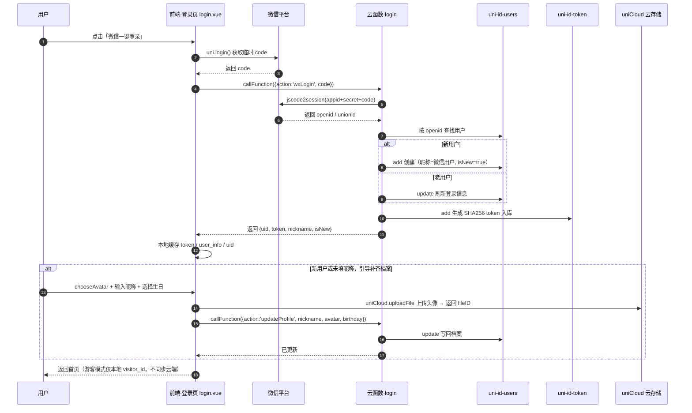
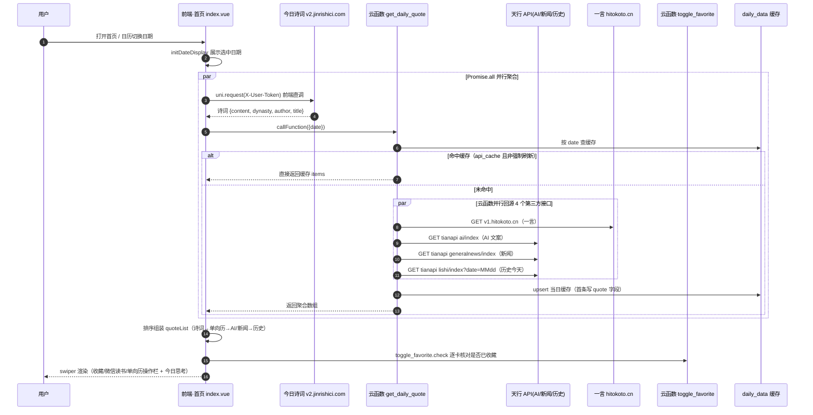
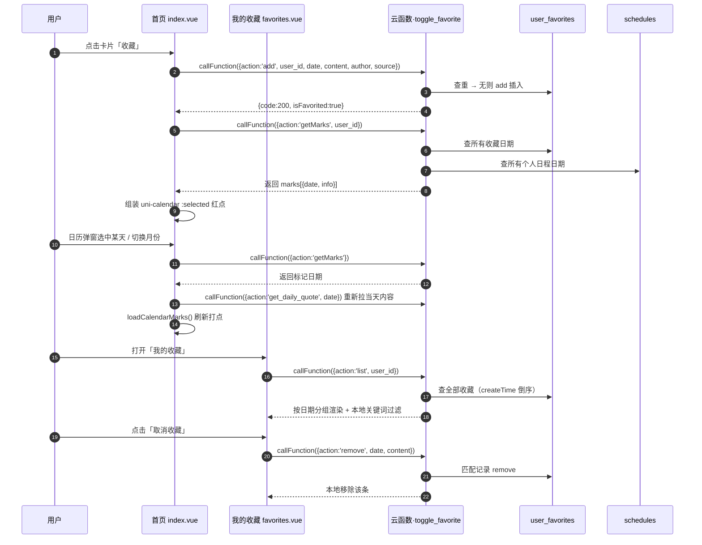
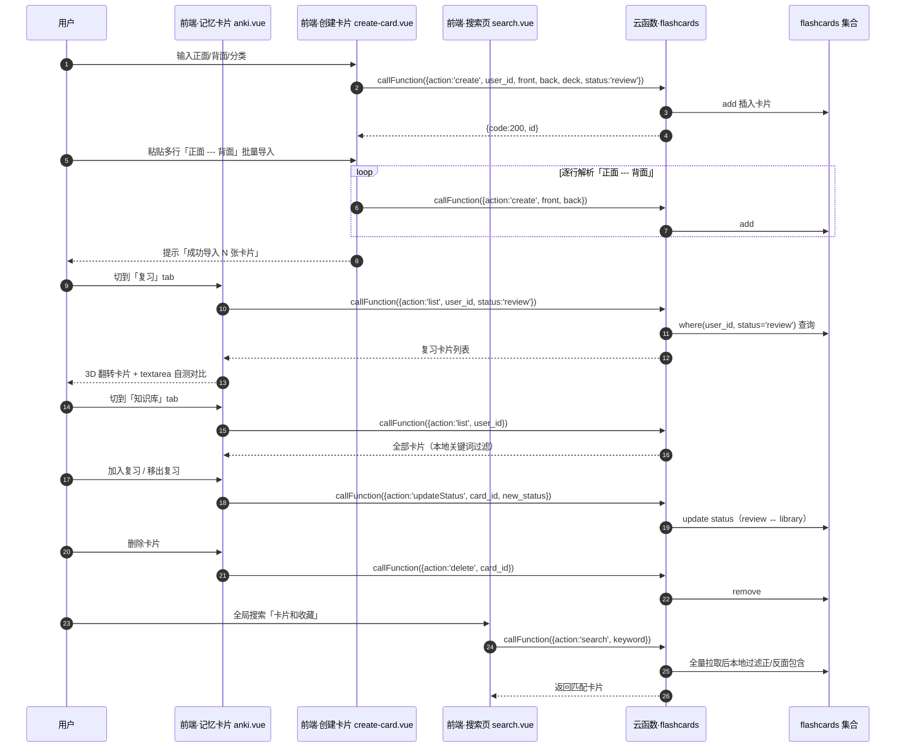
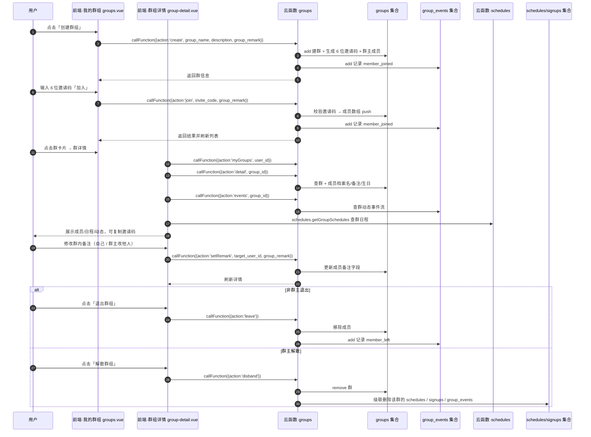
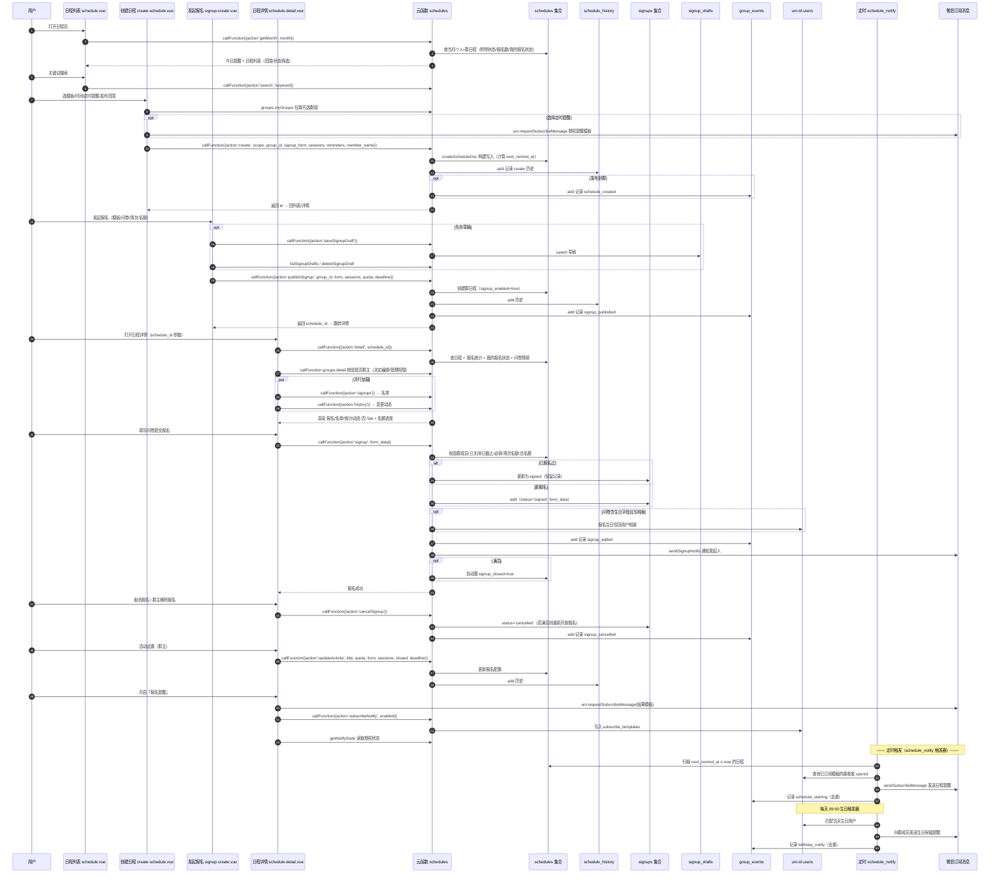

# 每日一言小程序 — 时序图与交互图

> 技术栈：uni-app (Vue3) + uniCloud (阿里云) + uni-ui，目标平台：微信小程序
> 图例：前端页面（左侧）→ 云函数（中间）→ 数据库 / 外部服务（右侧），箭头即一次前后端交互。

---

## 一、系统架构交互图（前端 ↔ 云函数 ↔ 数据库 ↔ 外部服务）

```mermaid
flowchart TB
    subgraph WX["微信小程序客户端"]
        U["用户"]
    end

    subgraph FE["前端页面 pages/ (uni-app · Vue3)"]
        P1["首页 index.vue<br/>每日一言 swiper · 日历 · 收藏/知识/日程入口"]
        P2["登录 login.vue"]
        P3["我的收藏 favorites.vue"]
        P4["记忆卡片 anki.vue"]
        P5["创建卡片 create-card.vue"]
        P6["日程列表 schedule.vue"]
        P7["创建日程 create-schedule.vue"]
        P8["日程详情 schedule-detail.vue"]
        P9["发起报名 signup-create.vue"]
        P10["我的群组 groups.vue"]
        P11["群组详情 group-detail.vue"]
        P12["搜索 search.vue"]
    end

    subgraph CF["uniCloud 云函数 cloudfunctions/"]
        F1["login<br/>wxLogin · updateProfile"]
        F2["get_daily_quote<br/>聚合每日一言/新闻/历史"]
        F3["toggle_favorite<br/>list · getMarks · check · add · remove"]
        F4["flashcards<br/>create · list · search · updateStatus · delete"]
        F5["groups<br/>create · join · myGroups · detail · setRemark · events · leave · disband"]
        F6["schedules<br/>日程/报名/草稿/提醒/历史/订阅"]
        F7["schedule_notify<br/>定时触发器 · 日程/生日提醒"]
    end

    subgraph EXT["外部服务"]
        E1["微信 jscode2session"]
        E2["今日诗词 v2.jinrishici.com"]
        E3["一言 v1.hitokoto.cn"]
        E4["天行 API<br/>AI一言 · 新闻 · 历史今天"]
        E5["微信读书小程序"]
        E6["单向历小程序"]
        E7["微信订阅消息"]
    end

    subgraph DB["uniCloud 数据库 collections"]
        D1["uni-id-users 用户档案"]
        D2["uni-id-token 登录令牌"]
        D3["daily_data 每日内容缓存"]
        D4["user_favorites 收藏"]
        D5["flashcards 记忆卡片"]
        D6["groups 群组"]
        D7["group_events 群动态"]
        D8["schedules 日程"]
        D9["schedule_history 日程历史"]
        D10["signups 报名记录"]
        D11["signup_drafts 报名草稿"]
    end

    U <--> P1
    P1 -- "fetchJinrishici 直调" --> E2
    P1 -- "get_daily_quote" --> F2
    P1 -- "toggle_favorite check/getMarks/add/remove" --> F3
    P1 -- "navigateToMiniProgram 跳转" --> E5
    P1 -- "navigateToMiniProgram 跳转" --> E6
    P2 <--> F1
    P3 --> F3
    P4 <--> F4
    P5 --> F4
    P6 <--> F6
    P7 <--> F6
    P8 <--> F6
    P9 <--> F6
    P10 <--> F5
    P11 <--> F5
    P11 --> F6
    P12 --> F4
    P12 -- "JQL 直查" --> D4

    F1 --> E1
    F1 --> D1
    F1 --> D2
    F2 --> E3
    F2 --> E4
    F2 --> D3
    F3 --> D4
    F3 --> D8
    F4 --> D5
    F5 --> D6
    F5 --> D7
    F6 --> D8
    F6 --> D9
    F6 --> D10
    F6 --> D11
    F6 --> D6
    F6 --> D7
    F6 --> D1
    F7 --> E7
    F7 --> D8
    F7 --> D6
    F7 --> D7
    F7 --> D1
```

---

## 二、登录与档案（login）

> 前端 `uni.login` 取 code → 云函数换 openid → 建/查用户 → 发 token → 前端存储 → 补齐头像/昵称/生日。

---

## 三、每日一言加载（get_daily_quote）

> 前端 `Promise.all` 并行：直调今日诗词 + 云函数聚合天行 AI/新闻/历史，云函数按 `date` 走 `daily_data` 缓存，未命中才回源并写缓存。

---

## 四、收藏与日历打点联动（toggle_favorite）

> 收藏写入 `user_favorites`，日历打点来自「收藏日期 ∪ 个人日程日期」，实现收藏 ↔ 日历双向联动。

---

## 五、记忆卡片（flashcards）

> 单卡创建 + `---` 批量导入 → `flashcards` 集合；复习/知识库双 tab 切换状态。

---

## 六、群组协作（groups）

> 邀请码建群/入群 → 群详情（成员档案/备注/生日）→ 群动态 → 退出/解散（级联清理）。

---

## 七、日程 · 报名 · 提醒（schedules + schedule_notify）

> 核心链路：创建/编辑日程 → 发起报名（可草稿）→ 群成员填问卷报名 → 名单/统计/动态 → 定时触发器推送订阅消息。

---

## 八、数据库集合与业务映射速查

| 集合 | 写入来源云函数 | 读取页面 | 核心字段 |
|---|---|---|---|
| `uni-id-users` | login / schedules(报名沉淀生日) | login / 群组 / 搜索 | openid, nickname, avatar, birthday, phone, subscribe_templates |
| `uni-id-token` | login | login | user_id, token |
| `daily_data` | get_daily_quote | index(经云函数) | date, quote, author, source, items |
| `user_favorites` | toggle_favorite | index / favorites / search | user_id, date, content, author, source |
| `flashcards` | flashcards | anki / create-card / search | user_id, front, back, deck, status |
| `groups` | groups | groups / group-detail / create-schedule / signup-create / schedules | group_name, creator_id, invite_code, members[] |
| `group_events` | groups / schedules / schedule_notify | group-detail | group_id, type, user_id, data |
| `schedules` | schedules / schedule_notify | schedule / schedule-detail / index(打点) | title, date, scope, group_id, signup_*, sessions, reminders, next_remind_at |
| `schedule_history` | schedules | schedule-detail | schedule_id, action, before, after, changed_by |
| `signups` | schedules | schedule-detail | schedule_id, group_id, user_id, status, form_data, signed_at |
| `signup_drafts` | schedules | signup-create | user_id, group_id, title, form, sessions |
